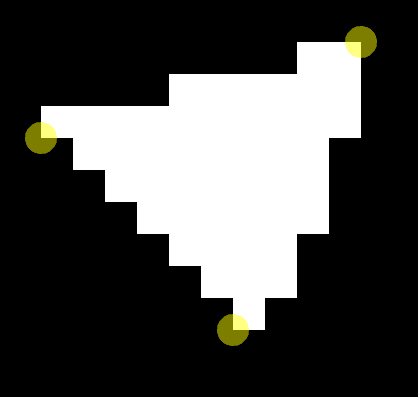
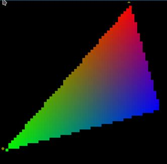
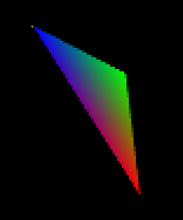
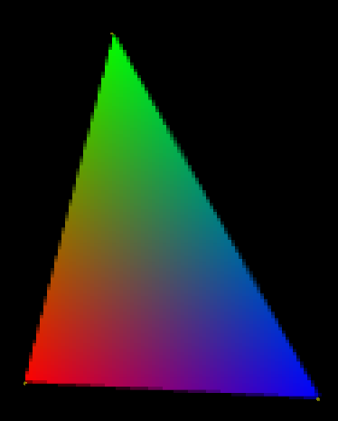

# Taller raster

## Propósito

Comprender algunos aspectos fundamentales del paradigma de rasterización.

## Tareas

Emplee coordenadas baricéntricas para:

1. Rasterizar un triángulo;
2. Implementar un algoritmo de anti-aliasing para sus aristas; y,
3. Hacer shading sobre su superficie.

Implemente la función ```triangleRaster()``` del sketch adjunto para tal efecto, requiere la librería [frames](https://github.com/VisualComputing/framesjs/releases).

## Integrantes

Máximo 3.

Complete la tabla:

|       Integrante         | github nick                                              |
|--------------------------|----------------------------------------------------------|
| Diego Andrés Baquero     | [diegobaqt](https://github.com/diegobaqt)                |
| Andrés Felipe López      | [andreslopzi](https://github.com/andreslopzi)            |


## Discusión

Describa los resultados obtenidos. Qué técnicas de anti-aliasing y shading se exploraron? Adjunte las referencias. Discuta las dificultades encontradas.

Los resultados obtenidos fueron los siguientes:

Inicialmente se hizo la correspondiente rasterización del triángulo.



Adicionalmente, se realiza la implementación de la técnica de Shading a este triángulo, obteniendo el siguiente resultado:



Posteriormente, se realiza la implementación del antialiasing:






Antialiasing: Es una técnica de suavizado de bordes o antiescalonamiento, donde se minimiza el aliasing cuando se desea representar una señal de alta resolución en un sustrato de más baja resolución.[3]

Adicionalmente, se utilizó subsampling con el fin de subdividir cada uno de los pixeles, es una técnica de procesamiento de imagen para reducir la resolución del color sin afectar el brillo

Finalmente, se hizo la implementación bajo coordenadas baricéntricas con el fin de definir la intensidad de cada uno de los colores para el shading.[4]


## Referencias

[1] http://www.sunshine2k.de/coding/java/TriangleRasterization/TriangleRasterization.html

[2] https://fgiesen.wordpress.com/2013/02/06/the-barycentric-conspirac/

[3] https://es.wikipedia.org/wiki/Antialiasing

[4] https://elcodigografico.wordpress.com/2014/03/29/coordenadas-baricentricas-en-triangulos/

## Entrega

* Modo de entrega: [Fork](https://help.github.com/articles/fork-a-repo/) la plantilla en las cuentas de los integrantes (de las que se tomará una al azar).
* Plazo: 1/4/18 a las 24h.
